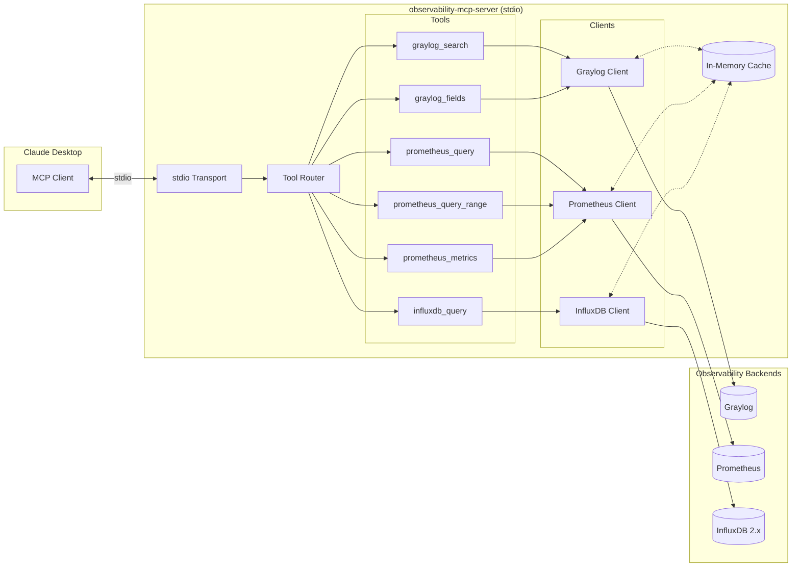

# Observability MCP Server - Spec

## Intent

Provide Claude Desktop with tools to query internal observability systems (Graylog, Prometheus, InfluxDB 2.x) via MCP protocol, enabling log search, metric queries, and time-series analysis without leaving the conversation.

## Architecture



## Config Schema

```yaml
# config.yaml
server:
  name: "observability-mcp-server"
  version: "1.0.0"
  log_level: "info"  # debug | info | warning | error

datasources:
  graylog:
    enabled: true
    url: "${GRAYLOG_URL}"           # e.g., https://graylog.internal:9000/api
    token: "${GRAYLOG_TOKEN}"       # API token
    timeout_seconds: 30
    # Query safety limits
    max_time_range_hours: 24        # Max span between from/to
    default_time_range_hours: 1     # Default if not specified
    max_results: 1000               # Hard cap on returned messages
    default_results: 100            # Default limit

  prometheus:
    enabled: true
    url: "${PROMETHEUS_URL}"        # e.g., http://prometheus.internal:9090
    timeout_seconds: 30
    # Query safety limits
    max_range_hours: 168            # 7 days max for range queries
    max_step_seconds: 3600          # Min granularity 1 hour for large ranges
    max_series: 10000               # Refuse queries returning too many series
    max_metric_results: 500         # Cap for metric list

  influxdb:
    enabled: true
    url: "${INFLUXDB_URL}"          # e.g., https://influxdb.internal:8086
    token: "${INFLUXDB_TOKEN}"
    org: "${INFLUXDB_ORG}"
    timeout_seconds: 60
    # Bucket allowlist - queries to unlisted buckets are rejected
    allowed_buckets:
      - "telegraf"
      - "app_metrics"
      - "system_metrics"
    # Query safety
    max_time_range_hours: 168       # 7 days

cache:
  enabled: true
  default_ttl_seconds: 60
  # Per-tool TTL overrides
  ttl_overrides:
    prometheus_metrics: 300         # Metric list changes slowly
    graylog_fields: 300             # Field list changes slowly
```

**Environment variables:** All `${VAR}` references are required. Server exits on startup if missing.

## Core Behavior

### Startup Sequence

| Phase | Action | Failure Behavior |
|-------|--------|------------------|
| 1. Load Config | Parse YAML, substitute env vars | Exit(1), log missing vars |
| 2. Validate Config | Check URLs, timeouts, limits | Exit(1), log validation errors |
| 3. Test Connections | Lightweight health check per enabled datasource | Log warning, mark datasource unavailable |
| 4. Register Tools | Register MCP tools for available datasources | Exit(1) if zero datasources available |
| 5. Start Transport | Begin stdio listen loop | Exit(1) on transport failure |

**Degraded mode:** If a datasource fails health check, its tools return error responses but server continues running with other datasources.

### Tool Definitions

---

#### `graylog_search`

**Description:** Search Graylog logs with query string and time range.

**Parameters:**

| Name | Type | Required | Description |
|------|------|----------|-------------|
| `query` | string | Yes | Graylog search query (Lucene syntax) |
| `from_time` | string | No | Start time (ISO8601 or relative: `-1h`, `-30m`). Default: `-1h` |
| `to_time` | string | No | End time (ISO8601 or relative: `now`). Default: `now` |
| `limit` | integer | No | Max results. Default: 100, Max: 1000 |
| `fields` | array[string] | No | Fields to return. Default: all |

**Validation:**
- Time range must not exceed `max_time_range_hours`
- `from_time` must be before `to_time`
- `limit` clamped to `max_results`
- Query string validated for injection patterns (no raw JSON injection)

**Response schema:**

```json
{
  "total_results": 1547,
  "returned": 100,
  "truncated": true,
  "query": "level:ERROR AND service:api",
  "time_range": {
    "from": "2025-01-27T10:00:00Z",
    "to": "2025-01-27T11:00:00Z"
  },
  "messages": [
    {
      "timestamp": "2025-01-27T10:45:23.123Z",
      "source": "api-server-01",
      "level": "ERROR",
      "message": "Connection timeout to database",
      "fields": {
        "service": "api",
        "trace_id": "abc123"
      }
    }
  ]
}
```

**Graylog API mapping:** `GET /api/search/universal/relative` or `/absolute` depending on time format.

---

#### `graylog_fields`

**Description:** List available fields in Graylog logs, optionally filtered by pattern.

**Parameters:**

| Name | Type | Required | Description |
|------|------|----------|-------------|
| `pattern` | string | No | Regex pattern to filter field names (e.g., `http_.*`, `error`). Default: none |
| `limit` | integer | No | Max fields to return. Default: 100, Max: 500 |

**Validation:**
- Pattern compiled as regex — return error if invalid
- Pattern match is case-insensitive
- Results sorted alphabetically

**Response schema:**

```json
{
  "fields": [
    {
      "name": "http_method",
      "type": "string"
    },
    {
      "name": "http_status_code",
      "type": "long"
    }
  ],
  "count": 2,
  "total_available": 347,
  "pattern": "http_.*",
  "truncated": false,
  "cached": true
}
```

**Graylog API mapping:** `GET /api/system/fields` (returns field name + type)

**Caching:** Full field list cached for `ttl_overrides.graylog_fields` seconds (default 300). Filtering applied on cache hit.

---

#### `prometheus_query`

**Description:** Execute instant PromQL query.

**Parameters:**

| Name | Type | Required | Description |
|------|------|----------|-------------|
| `query` | string | Yes | PromQL expression |
| `time` | string | No | Evaluation time (ISO8601 or Unix). Default: now |

**Response schema:**

```json
{
  "result_type": "vector",
  "result": [
    {
      "metric": {
        "__name__": "up",
        "instance": "localhost:9090",
        "job": "prometheus"
      },
      "value": {
        "timestamp": "2025-01-27T11:00:00Z",
        "value": "1"
      }
    }
  ]
}
```

**Prometheus API mapping:** `GET /api/v1/query`

---

#### `prometheus_query_range`

**Description:** Execute PromQL range query.

**Parameters:**

| Name | Type | Required | Description |
|------|------|----------|-------------|
| `query` | string | Yes | PromQL expression |
| `start` | string | Yes | Start time (ISO8601 or relative: `-1h`) |
| `end` | string | Yes | End time (ISO8601 or relative: `now`) |
| `step` | string | No | Query resolution (e.g., `15s`, `1m`, `1h`). Default: auto-calculated |

**Validation:**
- Range must not exceed `max_range_hours`
- Step auto-calculated if not provided: `range_seconds / 250` (max 250 data points)
- Step clamped to minimum 1s

**Response schema:**

```json
{
  "result_type": "matrix",
  "result": [
    {
      "metric": {
        "__name__": "http_requests_total",
        "method": "GET"
      },
      "values": [
        {"timestamp": "2025-01-27T10:00:00Z", "value": "100"},
        {"timestamp": "2025-01-27T10:01:00Z", "value": "105"}
      ]
    }
  ]
}
```

**Prometheus API mapping:** `GET /api/v1/query_range`

---

#### `prometheus_metrics`

**Description:** List available metric names, optionally filtered by pattern.

**Parameters:**

| Name | Type | Required | Description |
|------|------|----------|-------------|
| `pattern` | string | No | Regex pattern to filter metric names (e.g., `http_.*`, `cpu`). Default: none (return all, up to limit) |
| `limit` | integer | No | Max metrics to return. Default: 100, Max: 500 |

**Validation:**
- Pattern compiled as regex — return error if invalid
- Pattern match is case-insensitive
- Results sorted alphabetically

**Response schema:**

```json
{
  "metrics": [
    "http_request_duration_seconds",
    "http_requests_total"
  ],
  "count": 2,
  "total_available": 1547,
  "pattern": "http_.*",
  "truncated": false,
  "cached": true
}
```

**Implementation:**
1. Fetch full metric list from Prometheus (cached 300s)
2. Apply regex filter client-side
3. Apply limit
4. Return with metadata

**Prometheus API mapping:** `GET /api/v1/label/__name__/values`

**Caching:** Full metric list cached. Filtering applied on cache hit.

---

#### `influxdb_query`

**Description:** Execute Flux query against InfluxDB 2.x.

**Parameters:**

| Name | Type | Required | Description |
|------|------|----------|-------------|
| `query` | string | Yes | Flux query |
| `bucket` | string | Yes | Target bucket (must be in `allowed_buckets`) |

**Validation:**
- Bucket must exist in `allowed_buckets` config — reject with clear error if not
- Query must contain `from(bucket:` referencing the specified bucket — reject if bucket mismatch
- Time range in query validated against `max_time_range_hours` (best-effort parsing)

**Response schema:**

```json
{
  "tables": [
    {
      "columns": ["_time", "_value", "_field", "host"],
      "records": [
        {
          "_time": "2025-01-27T10:00:00Z",
          "_value": 45.2,
          "_field": "cpu_usage",
          "host": "server-01"
        }
      ]
    }
  ],
  "record_count": 1,
  "truncated": false
}
```

**InfluxDB API mapping:** `POST /api/v2/query` with `application/vnd.flux` content type.

**Response parsing:** InfluxDB returns annotated CSV. Parse to JSON tables.

---

### Caching Behavior

| Tool | Cacheable | Cache Key | TTL |
|------|-----------|-----------|-----|
| `graylog_search` | No | — | — |
| `graylog_fields` | Yes | `graylog_fields` | 300s |
| `prometheus_query` | No | — | — |
| `prometheus_query_range` | Yes (completed ranges only) | `prom_range:{query}:{start}:{end}:{step}` | 60s |
| `prometheus_metrics` | Yes | `prom_metrics` | 300s |
| `influxdb_query` | No | — | — |

**Rationale:** Log and instant metric queries are time-sensitive. Range queries with fixed bounds, metric lists, and field lists are cacheable.

## Error Handling

| Scenario | Error Code | Action |
|----------|------------|--------|
| Datasource disabled in config | `DATASOURCE_DISABLED` | Return error, suggest checking config |
| Datasource failed health check | `DATASOURCE_UNAVAILABLE` | Return error, include last health check time |
| Invalid query syntax | `INVALID_QUERY` | Return error with syntax hint if available |
| Invalid regex pattern | `INVALID_PATTERN` | Return error with regex compilation error |
| Time range exceeds limit | `TIME_RANGE_EXCEEDED` | Return error with max allowed |
| Bucket not in allowlist | `BUCKET_NOT_ALLOWED` | Return error, list allowed buckets |
| Results exceed limit | `RESULTS_TRUNCATED` | Return partial results with truncation flag |
| Upstream timeout | `UPSTREAM_TIMEOUT` | Return error with timeout value |
| Upstream 4xx | `UPSTREAM_CLIENT_ERROR` | Return error with upstream message |
| Upstream 5xx | `UPSTREAM_SERVER_ERROR` | Return error, suggest retry |
| Rate limit (future) | `RATE_LIMITED` | Return error with retry-after |

**Error response schema:**

```json
{
  "error": {
    "code": "TIME_RANGE_EXCEEDED",
    "message": "Requested time range (48h) exceeds maximum allowed (24h)",
    "details": {
      "requested_hours": 48,
      "max_hours": 24
    }
  }
}
```

## File Structure

```
observability-mcp-server/
├── src/
│   └── observability_mcp_server/
│       ├── __init__.py
│       ├── __main__.py              # Entry point
│       ├── server.py                # MCP server setup, tool registration
│       ├── config.py                # Config loader, validation
│       ├── cache.py                 # In-memory TTL cache
│       ├── clients/
│       │   ├── __init__.py
│       │   ├── base.py              # Base HTTP client with retry
│       │   ├── graylog.py           # Graylog API client
│       │   ├── prometheus.py        # Prometheus API client
│       │   └── influxdb.py          # InfluxDB API client
│       ├── tools/
│       │   ├── __init__.py
│       │   ├── graylog.py           # graylog_search, graylog_fields tools
│       │   ├── prometheus.py        # prometheus_* tools
│       │   └── influxdb.py          # influxdb_query tool
│       └── models/
│           ├── __init__.py
│           ├── config.py            # Pydantic config models
│           ├── responses.py         # Response schemas
│           └── errors.py            # Error types
├── tests/
│   ├── __init__.py
│   ├── conftest.py                  # Shared fixtures
│   ├── unit/
│   │   ├── __init__.py
│   │   ├── test_config.py
│   │   ├── test_cache.py
│   │   ├── test_time_parsing.py
│   │   ├── test_graylog_client.py
│   │   ├── test_prometheus_client.py
│   │   └── test_influxdb_client.py
│   └── integration/
│       ├── __init__.py
│       ├── test_graylog_tool.py
│       ├── test_prometheus_tool.py
│       └── test_influxdb_tool.py
├── config/
│   ├── config.example.yaml
│   └── config.yaml                  # Gitignored
├── Docs/
│   ├── spec.md                      # This file
│   ├── PROGRESS.md
│   ├── testing-harness.md
│   └── discovery-notes.md           # API response samples
├── pyproject.toml
├── README.md
└── .env.example
```

## Dependencies

```toml
[project]
name = "observability-mcp-server"
version = "1.0.0"
requires-python = ">=3.11"
dependencies = [
    "mcp>=1.0.0,<2.0.0",             # MCP SDK - pin to 1.x
    "httpx>=0.27.0",                  # Async HTTP client
    "pydantic>=2.5.0",                # Config/response validation
    "pydantic-settings>=2.1.0",       # Env var loading
    "pyyaml>=6.0",                    # Config parsing
    "cachetools>=5.3.0",              # TTL cache implementation
]

[project.optional-dependencies]
dev = [
    "pytest>=8.0.0",
    "pytest-asyncio>=0.23.0",
    "pytest-httpx>=0.30.0",           # Mock httpx requests
    "ruff>=0.1.0",                    # Linting
    "mypy>=1.8.0",                    # Type checking
]
```

## Out of Scope

- **Redis caching** — deferred to Phase 2
- **Cloud status integrations** (AWS, Cloudflare, M365) — Phase 3
- **MCP Resources** — Phase 2
- **MCP Prompts** — Phase 2
- **SSE/HTTP transport** — Claude Desktop uses stdio only
- **Multi-user rate limiting** — single-user tool
- **Alerting/notifications** — query only
- **Query builder UI** — Claude constructs queries
- **InfluxDB 1.x support** — 2.x only
- **Graylog basic auth** — token only
- **Prometheus auth** — open endpoint only
- **Graylog stream filtering** — query all streams

---

## Testing Strategy

### Archetype

**Discovery Polling Exporter** — closest match (queries external APIs, transforms responses, no write operations)

### Pre-Implementation Discovery

Discovery completed — existing Python integrations with all three systems confirmed.

**Capture before Phase 1 (save to `Docs/discovery-notes.md`):**
- Sample Graylog search response (JSON structure)
- Sample Graylog fields response
- Sample Prometheus instant query response
- Sample Prometheus range query response
- Sample Prometheus metric list response
- Sample InfluxDB Flux CSV response

### What to Test

| Category | Scope | Mock/Real |
|----------|-------|-----------|
| Config loading | YAML parsing, env var substitution, validation | Mock filesystem |
| Time range validation | Boundary conditions, relative time parsing | Unit (no I/O) |
| Regex pattern validation | Valid/invalid patterns, case sensitivity | Unit (no I/O) |
| Cache behavior | TTL expiry, key generation, hit/miss | Unit (no I/O) |
| Graylog client | Request building, response parsing, error handling | Mock HTTP (pytest-httpx) |
| Prometheus client | Request building, response parsing (vector/matrix/scalar) | Mock HTTP |
| InfluxDB client | Request building, CSV parsing, bucket validation | Mock HTTP |
| Tool integration | End-to-end tool call with mocked clients | Mock clients |
| Real integration | Actual queries against dev instances | Real (manual/CI with secrets) |

### What NOT to Test (Operator Verification)

- Actual query performance under load
- Network latency to production backends
- Credential rotation
- Long-running stability (multi-day uptime)

### Mock Boundaries

| Dependency | Mock Strategy | Notes |
|------------|---------------|-------|
| Graylog API | pytest-httpx response fixtures | Record real responses for fixtures |
| Prometheus API | pytest-httpx response fixtures | Cover vector, matrix, scalar types |
| InfluxDB API | pytest-httpx response fixtures | Include annotated CSV samples |
| Filesystem (config) | tmp_path fixture | Standard pytest approach |
| Environment vars | monkeypatch | Standard pytest approach |

### Critical Path (High Coverage)

- [ ] `config.py` — misconfiguration is the #1 failure mode
- [ ] `clients/*.py` — response parsing, error classification
- [ ] Time range validation — security boundary
- [ ] Regex pattern handling — user input validation

### Coverage Targets

| Package | Target | Focus |
|---------|--------|-------|
| `config` | 90% | validation, env var substitution, edge cases |
| `clients` | 90% | response parsing, error paths |
| `tools` | 80% | parameter validation, pattern filtering |
| `cache` | 80% | TTL behavior |
| `server` | 70% | happy path |

### Concurrency Testing

- [ ] Race detection needed? **No** — single-threaded async, no shared mutable state except cache
- [ ] Cache thread safety: `cachetools.TTLCache` is not thread-safe but acceptable for single-threaded async

---

## Implementation Order

### Phase 1: Foundation

**Unit 1a: Project scaffold + models**
1. `pyproject.toml` — dependencies, project metadata
2. `src/observability_mcp_server/__init__.py` — package init
3. `src/observability_mcp_server/models/errors.py` — error types enum
4. `src/observability_mcp_server/models/config.py` — Pydantic config models
5. `src/observability_mcp_server/models/responses.py` — response schemas
6. `tests/unit/test_config.py` — config model validation tests
   ```bash
   pytest tests/unit/test_config.py -v
   ```

**Unit 1b: Config loader + cache**
7. `src/observability_mcp_server/config.py` — YAML loader, env var substitution
8. `src/observability_mcp_server/cache.py` — TTL cache wrapper
9. `tests/unit/test_cache.py` — cache TTL and key tests
   ```bash
   pytest tests/unit/test_config.py tests/unit/test_cache.py -v
   ```

**✓ CHECKPOINT:** `pytest tests/unit/ -v`
**→ NEW CHAT after passing. Update PROGRESS.md first.**

### Phase 2: HTTP Clients

**Unit 2a: Base client + Graylog**
10. `src/observability_mcp_server/clients/base.py` — base HTTP client with retry, timeout
11. `src/observability_mcp_server/clients/graylog.py` — Graylog API client
12. `tests/unit/test_graylog_client.py` — request building, response parsing
    ```bash
    pytest tests/unit/test_graylog_client.py -v
    ```

**Unit 2b: Prometheus client**
13. `src/observability_mcp_server/clients/prometheus.py` — Prometheus API client
14. `tests/unit/test_prometheus_client.py` — vector/matrix/scalar parsing
    ```bash
    pytest tests/unit/test_prometheus_client.py -v
    ```

**Unit 2c: InfluxDB client**
15. `src/observability_mcp_server/clients/influxdb.py` — InfluxDB API client, CSV parsing
16. `tests/unit/test_influxdb_client.py` — CSV to JSON, bucket validation
    ```bash
    pytest tests/unit/test_influxdb_client.py -v
    ```

**✓ CHECKPOINT:** `pytest tests/unit/ -v`
**→ NEW CHAT after passing. Update PROGRESS.md first.**

### Phase 3: MCP Tools

**Unit 3a: Graylog tools**
17. `src/observability_mcp_server/tools/graylog.py` — `graylog_search`, `graylog_fields`
18. `tests/integration/test_graylog_tool.py` — tool parameter validation, mock responses
    ```bash
    pytest tests/integration/test_graylog_tool.py -v
    ```

**Unit 3b: Prometheus tools**
19. `src/observability_mcp_server/tools/prometheus.py` — `prometheus_query`, `prometheus_query_range`, `prometheus_metrics`
20. `tests/integration/test_prometheus_tool.py` — tool tests with mocked client
    ```bash
    pytest tests/integration/test_prometheus_tool.py -v
    ```

**Unit 3c: InfluxDB tools**
21. `src/observability_mcp_server/tools/influxdb.py` — `influxdb_query`
22. `tests/integration/test_influxdb_tool.py` — bucket allowlist, query validation
    ```bash
    pytest tests/integration/test_influxdb_tool.py -v
    ```

**✓ CHECKPOINT:** `pytest tests/ -v`
**→ NEW CHAT after passing. Update PROGRESS.md first.**

### Phase 4: Server Assembly

**Unit 4a: Server + entry point**
23. `src/observability_mcp_server/server.py` — MCP server, tool registration, health checks
24. `src/observability_mcp_server/__main__.py` — entry point, startup sequence
25. `config/config.example.yaml` — example config
26. `.env.example` — environment variable template
27. `README.md` — setup and usage docs

**✓ FINAL:** `pytest tests/ -v && python -m observability_mcp_server --help`
**→ DELIVER to user. Implementation complete.**

---

## Progress Tracking

### Session Protocol

**On every new session:**
1. Read `Docs/PROGRESS.md` to see current state
2. Scan existing files to verify progress is accurate
3. Run test suite to check status
4. Resume from next incomplete item

**After each completed unit:**
1. Update `Docs/PROGRESS.md` checklist
2. Log test results in Session Log
3. Note any blockers or decisions

**On failure:**
1. Log to Error Recovery Log with root cause
2. If 2nd failure on same issue, change approach
3. If 4th failure, stop and escalate to user

**After each CHECKPOINT passes:**
1. Commit working code
2. Update `Docs/PROGRESS.md` with completion status
3. **Start a new chat** — context isolation prevents drift

### First Session Setup

1. Create `Docs/PROGRESS.md` from template
2. Create `Docs/testing-harness.md` from archetype template
3. Capture API response samples in `Docs/discovery-notes.md`
4. Begin Phase 1
